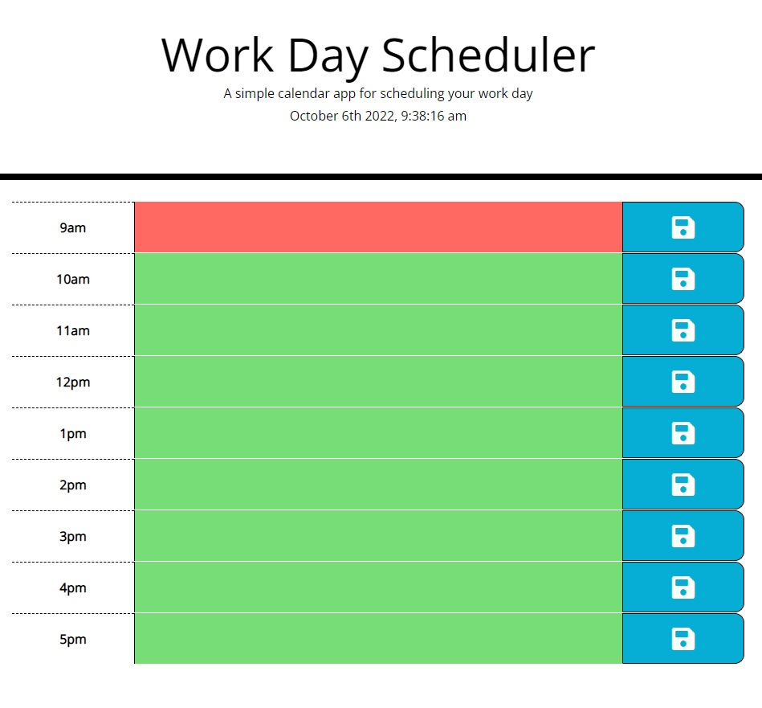

# work-day-scheduler

https://jaxpi.github.io/DEPLOYEDLINK/
 

## Description

This application allows users with busy schedules to add important events to a daily planner to manage their time more effectively. The current date and time is displayed at the top so the user can be aware of this and the background color of each row will change as well based on whether that row is for the current hour, hours in the past, or hours in the future. Events in the current hour will display red to alert the user that they are happening/due now. Past events are grayed-out to show that they are over. Future events display green so the user know they still have time for them.

## Usage

The user clicks into the text-input section of the row corresponding to the time of the event and types in the event's name and/or a short description of it. The user then clicks on the save icon of that row to store the information so it will still be there if the user closes their browser. To clear the event the user can delete the text for the event and click the save icon again.

## Credits

Moment.js

## License

MIT License

Copyright (c) 2022 Jackson Impellizeri

Permission is hereby granted, free of charge, to any person obtaining a copy
of this software and associated documentation files (the "Software"), to deal
in the Software without restriction, including without limitation the rights
to use, copy, modify, merge, publish, distribute, sublicense, and/or sell
copies of the Software, and to permit persons to whom the Software is
furnished to do so, subject to the following conditions:

The above copyright notice and this permission notice shall be included in all
copies or substantial portions of the Software.

THE SOFTWARE IS PROVIDED "AS IS", WITHOUT WARRANTY OF ANY KIND, EXPRESS OR
IMPLIED, INCLUDING BUT NOT LIMITED TO THE WARRANTIES OF MERCHANTABILITY,
FITNESS FOR A PARTICULAR PURPOSE AND NONINFRINGEMENT. IN NO EVENT SHALL THE
AUTHORS OR COPYRIGHT HOLDERS BE LIABLE FOR ANY CLAIM, DAMAGES OR OTHER
LIABILITY, WHETHER IN AN ACTION OF CONTRACT, TORT OR OTHERWISE, ARISING FROM,
OUT OF OR IN CONNECTION WITH THE SOFTWARE OR THE USE OR OTHER DEALINGS IN THE
SOFTWARE.
